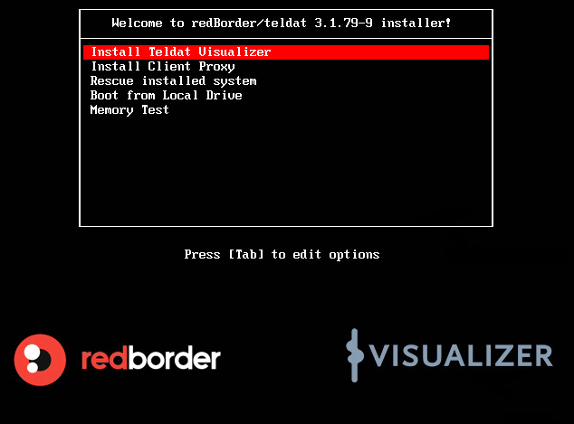
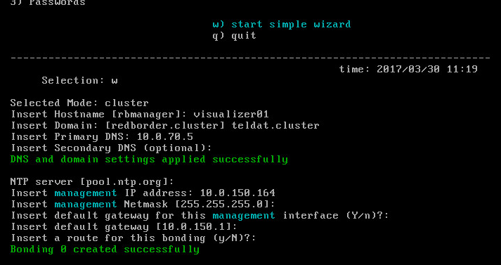
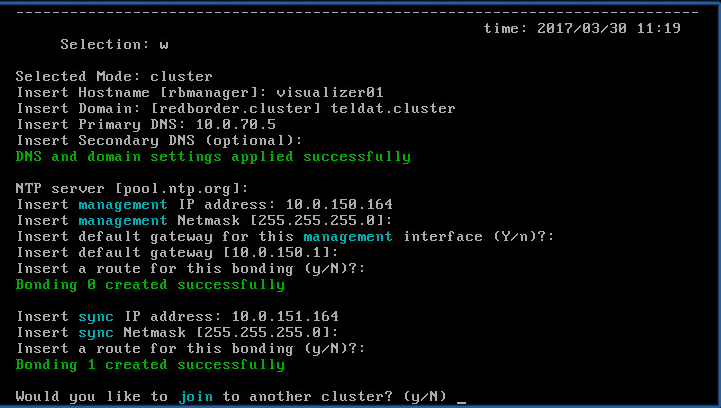
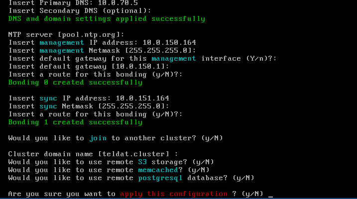

== Capítulo 1: Instalación de Teldat Visualizer

En este capítulo se describe el proceso para realizar una instalación de Teldat Visualizer Enterprise. En lo que resta de
la presente documentación nos referiremos a la máquina donde se va a instalar Teldat Visualizer como *manager*.

=== Instalación

Para la instalación del manager, el usuario dispondrá de una imagen ISO con la que se deberá arrancar la máquina
en la que se va a instalar.

Al iniciar el asistente de instalación tendrá acceso a un menú tal y como se muestra a continuación:

Seleccionamos "*Install Teldat Visualizer*" para comenzar la instalación.

En pocos segundos nos aparecerá otro menú como el que se muestra a continuación:

image::images/install/install-02.png["install-02",link="images/install/install-02.png",align="center"]

En este paso el instalador nos preguntará la unidad de disco en la que deseamos realizar la instalación.

[NOTE]
===============================
La unidad seleccionada será formateada por el instalador
===============================

También en este menú se nos preguntará por la contraseña que deseamos configurar para el usuario "root" del sistema.

IMPORTANT: Por defecto la contraseña de root es "*teldat*"

Tras esto se procederá a la instalación de los paquetes de instalación del software en el disco duro.

image::images/install/install-03.png["install-03",link="images/install/install-03.png",align="center"]

Espere hasta que lla instalación se haya completado al 100%. Este proceso puede durar unos minutos.

Una vez finalizada la instalación, el sistema será reiniciado. Durante el primer arranque el sistema procederá
a realizar una serie de acciones para configurarse por primera vez.

[NOTE]
===============================
Este proceso puede tardar varios minutos
===============================

Una vez que en la terminal nos apareczca la sigueinte imagen, ya podremos acceder.

image::images/install/install-04.png["install-04",link="images/install/install-04.png",align="center"]

IMPORTANT: LAs credenciales por defecto son "usuario: root / password: teldat"

=== Configuración inicial - Wizard

Una vez hemos hecho login en el manager, debemos ejecutar el comando *rb_sysconf* para realizar la configuración inicial.

Estas son las opciones que encontrará en la pantalla principal de este menú:

. *System Configuration*: configuración del hostname, IP del Manager, hora y estado del Manager.
. *Network Configuration*: creación de bondings, segmentos, DNS, rutas e IPMI. Recuerde que, para poner en funcionamiento el Manager, se necesitan por lo menos dos conexiones de red.
. *Passwords*: acceda a esta opción si desea modificar las contraseñas que haya definido por cada rol de usuario.
. *w) start simple wizard*: inicia un asistente que le permitirá de forma sencilla y rápida realizar la instalación y configuración del Manager.
. *q) quit*: Salir. Nos devuelve a la pantalla principal de configuración del sistema.

image::images/install/install-05.png["install-05",link="images/install/install-05.png",align="center"]

Para realizar la instalación automática del manager, usaremos la opción *w) start simple wizard*.

Como podrá comprobar, existen una serie de opciones definidas por defecto.
Para aceptarlas tan solo tiene que pulsar Enter. No obstante, puede modificarlas manualmente
en cualquier momento del proceso de instalación.

*Mode, Hostname, DNS y NTP*

. Selected Mode: cluster. Seleccionar el modo cluster para unir más de un Manager.
. Insert Hostname [rbmanager]. La opción que viene definida por defecto es la de rbmanager. Este es un nombre que identifica de manera clara y sencilla al Manager y su posición dentro del cluster.
. Insert domain: [redborder.cluster]. Dominio definido por defecto.
. Insert DNS Primary. Definido por defecto. El usuario podrá cambiarlo para indicar el servidor que provee DNS a su red y al que estará asociado el Manager.
. Insert DNS Secondary (optional). Indicar DNS secundario de manera opcional. Se aconseja introducir un DNS alternativo que sustituya al DNS primario en caso de fallo del servidor

IMPORTANT: Es importante que se utilicen diferentes nombres para cada uno de los Managers que se van a unir al cluster.

Una vez introducidos estos valores, el sistema le avisará de que los cambios han sido aplicados con éxito mediante el siguiente
mensaje rotulado en verde: DNS and domain settings applied successfully.

image::images/install/install-06.png["install-06",link="images/install/install-06.png",align="center"]

*Configuración de NTP y red de gestión*

El siguiente paso es indicar el servidor de hora: *NTP server [pool.ntp.org]:*
Si existe algún NTP server en su red, se debe indicar. En caso contrario, se asignará uno por defecto.

Si sólo va a desplegar un manager, necesitará una única interfaz de red. Por el contrario, si va a desplegar un cluster
con múltiples managers será necesario al menos reservar 2 interfaces de red.

Para la creación de un cluster es necesario que el usuario reserve dos interfaces de red:

* Una para la red de gestión (Management IP address)
* Otra para la red de sincronismo (Sync IP address)

En cada una de estas interfaces se configurará un bonding de red.

La configuración del bonding de gestión solicitará los siguientes datos:

* Insert management IP address:
* Insert management Netmask
* Insert default gateway for this management interface (Y/n)
* Insert a route for this bonding (y/N)?: Opción para insertar una ruta estática.

Una vez introducidos estos valores, el sistema le avisará de que el bonding ha sido creado con éxito.

*Configuración de red de sincronismo*

Si hemos configurado la máquina con 2 interfaces de red, a continuación tendremos que configurar el bonding para
la red de sincronismo.

[NOTE]
===============================
Esta parte no aparecerá si sólo hemos configurado una interfaz de red en la máquina
===============================

*Configuración de cluster y servicios externos*

Como último paso se preguntan una serie de opciones de configuración relacionadas con la creación de un cluster de varios managers
y la configuración de servicios fuera del manager.

Una vez finalizado, aceptamos y se iniciará el proceso de configuración.

[NOTE]
===============================
Este proceso puede tardar varios minutos
===============================
