== Capítulo 5: Visualización de datos

En esta sección el usuario puede realizar la visualización, análisis y gestión de los eventos recogidos.

=== 5.1 Traffic: menú y opciones

En el área de análisis de la barra de menú (lateral izquierdo), encontramos las diferentes secciones que corresponden a las Apps que tengamos integradas en la plataforma.

A continuación veremos las diferentes opciones de visualización de datos, tipos de gráficas, granularidad (nivel de detalle temporal con el que se agregan los eventos) y atributos que se pueden combinar para obtener un visor de tráfico de red completamente personalizado.

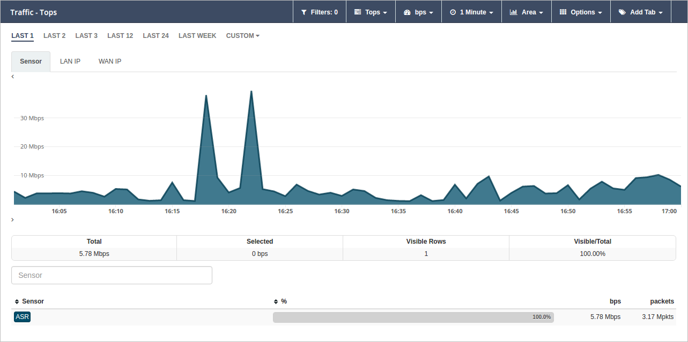

==== 5.1.1 Opciones disponibles en el submenú de la sección Traffic

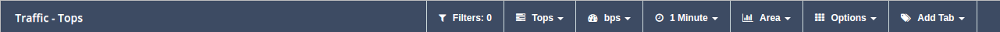

* Filtros (*Filters*): permite al usuario aislar una porción de información para conseguir mayor grado de detalle. En esta pestaña, el usuario podrá visualizar el número de filtros que se han aplicado y realizar las siguientes acciones sobre los mismos:

** Crear un filtro avanzado (*Advanced Search*)
** Crear una alarma en base a las condiciones de los filtros aplicados (*Create an alarm*)
** Crear un widget basado en los filtros aplicados e incluirlo en un dashboard o informe (*Create a widget on*)
* *Vistas*: ofrece diferentes opciones de visualización de la información. Se explicarán con detalle posteriormente.
* *Agregación*: son los diferentes valores o unidades de medida en las que se pueden mostrar los datos. Por ejemplo, flows por segundo (flows/s) o bytes por segundo (bps)
* *Granularidad*: indica el grado de detalle temporal con el que es posible visualizar los datos. El mínimo valor de granularidad es un minuto.
* *Tipo de gráfica*: muestra los diferentes tipos de gráficas entre los que podemos elegir para mostrar los datos. Los tipos de gráficas disponibles varían según el tipo de vista seleccionada. Estos son los siguientes:
** Area
** Stacked
** Line
** Bars
** SBars
* *Opciones*: en este apartado el usuario podrá realizar diferentes acciones para la gestión de los datos que se muestran en esta sección. Las opciones varían según el tipo de vista seleccionada.
** Mostrar total (*Show Total*)
** Exportar a CSV (*Export to CSV*)
** Máquina del tiempo (*Time Machine*)
** Guardar las pestañas como predeterminadas (*Save tabs as default*)
** Ordenar agregaciones (*Sort Aggregations*)
** Ordenar columnas (*Sort columns*)
* *Atributos*: Los eventos recibidos por el Manager están compuestos por duplas del tipo "columna:valor". Los valores que se indican en cada columna pueden entenderse como datos propios del evento, que son los que realmente nos aportan información. Estos son llamados "atributos".
+
Los atributos pueden mostrarse de varias maneras: en forma de pestañas o de columnas. (*Add tabs/Columns*) dependiendo de la vista que estemos consultando.

[NOTE]
==================================
A lo largo de este documento podrán encontrarse referencias al concepto de columna como "atributo" o "dimensión".
==================================

==== 5.1.2 Cuerpo de la pantalla: filtrado por rango de tiempo, pestañas de atributos y vistas.

*Filtrado por rango de tiempo*: acceso directo a los eventos filtrados en base a un periodo de tiempo.

Existe la posibilidad de seleccionar un rango de fechas diferente a las que se ofrecen por defecto. Dependiendo de las necesidades del usuario, podrá realizar una selección de tiempo personalizada a través de la opción *Custom*. Más adelante se especificará el procedimiento a seguir para realizar un filtro temporal personalizado.

*Pestañas de atributos*: clasifican la información del tráfico de red por atributos. Navegando por cada una de las pestañas podemos conocer en detalle los valores asociados a los atributos que hayamos seleccionado.

NOTE: El usuario puede variar el orden en el que se muestran las pestañas en cualquier momento. Para ello, debe arrastrar la pestaña y soltarla en la posición que desee.

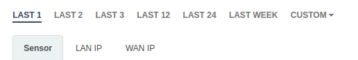

*Vista*:  en esta zona se muestran los datos según la vista y tipo de gráfica seleccionadas. Al posicionar el cursor sobre cualquiera de los puntos que componen la gráfica, aparece un cuadro de diálogo que muestra en detalle la información para ese instante de tiempo, agregación y atributo.

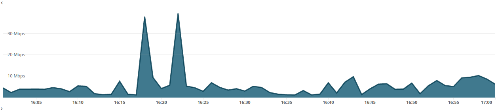

==== 5.1.3 Resumen, buscador y tabla de datos

*Resumen*: bajo el área de Vista se encuentra un resumen relativo a todos los datos cargados que aparecen tanto en la vista como en la tabla de datos. En este resumen se indican, por este orden:

* *Total*: valor total de la agregación de todos los datos cargados.
* *Selected*: valor total de la agregación de todos los datos cargados y seleccionados.
* *Visible Rows*: número de filas de datos cargadas.
* *Visible/Total*: porcentaje del valor agregado de los datos cargados sobre el valor agregado del total de datos.

*Buscador*: permite realizar una búsqueda por atributo. Las búsquedas se convierten en filtros automáticamente tal y como veremos más adelante.

*Tabla de datos*: muestra los valores clasificados por tipo de atributo seleccionado. Por ejemplo, cada fila puede estar mostrando cada una de las IPs de origen (Columna/Atributo: SRC Address) con el detalle del porcentaje de bytes (Agregación) que está consumiendo ese elemento dentro de la red. Para el análisis aislado de un elemento de esta tabla es necesario hacer clic sobre el elemento que se desee filtrar. Para el análisis de más de un elemento se deberá realizar una selección múltiple, manteniendo pulsada la tecla *Ctrl* y seleccionando distintos elementos o, si se desea seleccionar un rango, utilizando la tecla *Shift*.

image::images/data-visualization/overview.png[align="center"]

=== 5.2 Filtrar eventos

La opción *Filters* permite el filtrado de eventos según criterios definidos por el usuario. Estos filtros pueden ser almacenados para ser usados posteriormente como plantilla para la visualización de los eventos.

*Opciones de filtrado*:

* *Filter Zoom*: tras seleccionar un rango temporal en la vista gráfica, es posible filtrar por ese rango de tiempo haciendo clic en el botón *Filter Zoom* que aparece en las opciones del submenú.
* Filtrar por valor de atributo (*Filter Selected*): permite filtrar los elementos de la tabla seleccionados.
* Excluir por valor de atributo (*Exclude Selected*): permite excluir los elementos de la tabla seleccionados.
* Búsqueda avanzada (*Advanced Search*): permite establecer condiciones para realizar una búsqueda avanzada que actúe a modo de filtro. Muy útil para aislar y analizar datos muy concretos.

Para guardar un filtro basta con seleccionar la opción *+Save Current Filter*.

image::images/data-visualization/advanced_search.png[align="center"]

*Acciones para los filtros:*

Además de la opción de búsqueda avanzada (*Advanced Search*), el menú *Filters* muestra las siguientes opciones:

* Crear alarmas (*Create an alarm*): nos permite configurar una alarma en base a los filtros aplicados.
* Crear un widget en (*Create a widget on*): crea un widget a partir de los filtros aplicados que se puede incluir en dashboards  o informes.

==== 5.2.1 Filtro temporal personalizado

Es posible aislar los eventos correspondientes a un periodo de tiempo determinado para analizar con mayor grado de detalle los datos vinculados al atributo seleccionado.

Existen cinco maneras de realizar un filtrado temporal:

* Filtrado por rango de tiempo
* Filter Zoom
* Filtro personalizado
* Búsqueda avanzada
* Filtrado por atributo

*Filtrado por rango de tiempo*

Una manera muy sencilla y rápida de visualizar tan solo los eventos correspondientes a un periodo de tiempo concreto es seleccionar algunas de las opciones que nos ofrecen las pestañas de la línea temporal de filtrado:

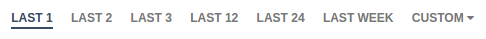

*Filter Zoom*

El usuario puede seleccionar un lapso de tiempo determinado de manera manual. Este filtro es muy útil para observar en detalle un evento. Para ello, hacer clic con el ratón en un punto determinado de la gráfica, arrastrar hasta el instante temporal deseado y soltar. De este modo, tendremos la vista para ese rango temporal y la tabla inferior mostrará tan solo los datos incluidos en esta franja.

En el submenú de sección aparecerá indicado *Filter Zoom*.

image::images/data-visualization/filter_zoom.png[align="center"]

*Filtro personalizado (Custom)*

La pestaña *Custom* de la línea de filtrado por rango de tiempo permite realizar un filtrado personalizado. Solo con arrastrar el ratón sobre la barra temporal es posible indicar una fecha de incio y de fin para el filtrado.

Hacer clic en *Submit* para aplicar filtro.

image::images/data-visualization/custom_filter.png[align="center"]

*Búsqueda avanzada (Advanced Search)*

Al hacer clic en la pestaña *Filters* se despliega un submenú en el que encontramos la opción *Advanced Search*.

Esta es la opción que permite mayor grado de detalle, puesto que es el propio usuario el que determina las condiciones de la búsqueda, y por tanto, de filtrado.

image::images/data-visualization/advanced_search.png[align="center"]

*Filtrado por atributo (Filter Selected)*

Existen dos maneras de convertir un valor de un atributo en un filtro:

1. *Buscador*: introducir el valor del atributo que se desea buscar y pulsar la tecla *Enter*.

+
De manera automática se incluirá un filtro con el valor elegido. Se pueden incluir tantos filtros como búsquedas se realicen. Es posible eliminar el filtro desde la opción Filters.

2. *Selección filas de la tabla*: es posible seleccionar una o más filas de la tabla simplemente hacer clic en cada una de ellas. Las filas seleccionadas aparecerán sombreadas en amarillo.

+
Una vez seleccionadas las filas seleccionar la opción *Filter Selected* para obtener la vista de los elementos filtrados. Para eliminar el filtro es necesario pulsar el botón *Exclude Selected*.

+
Es posible realizar acciones a nivel individual sobre cada uno de los elementos de la tabla. Haciendo clic sobre un elemento se despliega un submenú con las siguientes opciones:

+
*Filter*: añade el filtro correspondiente para incluir el elemento de los datos presentados.

+
*Exclude*: añade el filtro correspondiente para excluir el elemento de los datos presentados.

image::images/data-visualization/attributes_selection.png[align="center"]

=== 5.3 Vistas: múltiples opciones para visualizar los datos

Las vistas ofrecen múltiples perspectivas para la visualización de los datos asociados al tráfico de red. Las vistas que se encuentran disponibles en la App Traffic son las siguientes:

* *Tops:* agregación de los eventos en base a una unidad para mostrar los más destacados. Suma el total de datos de diferentes eventos para mostrarlo como uno único.
* *Raw:* vista de la totalidad de datos de los eventos en bruto, clasificados por atributos y franjas de tiempo.
* *Compare:* comparación de intervalos de tiempo para analizar diferencias en el estado de la red.
* *Unique:* muestra los diferentes elementos que han interactuado con la red según el atributo.

NOTE: Las opciones que se muestran en la pestaña *Options* y los atributos *Add tab/Columns* variarán según el tipo de vista elegida.

IMPORTANT: No olvide combinar las vistas con los diferentes tipos de gráficas. De este modo obtendrá múltiples posibilidades de análisis de los datos.

==== 5.3.1 Tops

La vista *Tops* nos permite visualizar cuáles han sido los eventos más destacados según el intervalo de tiempo que se haya seleccionado. Lo que visualizamos en la gráfica es la suma del total de dichos eventos mostrados como un único evento. Si pasamos el ratón por encima la gráfica, veremos el desglose del evento por día, hora y tipo de dimensión o atributo que se esté consultando.

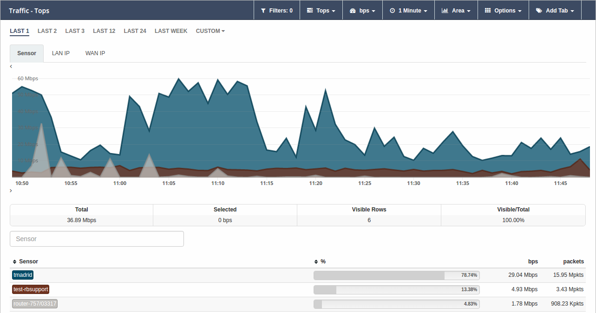

==== 5.3.2 Raw

Esta vista nos ofrece los datos de los eventos en bruto, por tanto, visualizaremos la totalidad de eventos por atributos segmentados por franjas de tiempo.

La tabla de datos recogerá, por tanto, todos los eventos ordenados en el tiempo. Si desea ver más eventos, basta con ir al final de la tabla y aparecerán eventos anteriores.

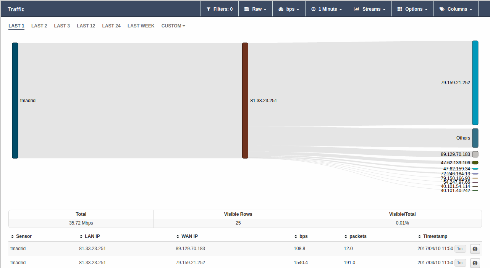

image::images/data-visualization/raw_detail.png[align="center"]

[NOTE]
=======================
Como se puede observar en la imagen, el tipo de gráfica ideal para la vista Raw es el de flujo de
  datos o *Streams*.

En la vista Raw los atributos se muestran en columnas.
=======================

==== 5.3.3 Compare
Esta vista ofrece una comparativa de la evolución de los eventos entre distintas horas, días, semanas o meses.
De este modo, el usuario puede identificar de forma rápida el momento de mayor uso de la red en función de distintos parámetros, como pueden ser los bytes consumidos, los paquetes transmitidos o los flujos recibidos.

En la tabla de datos se muestra la suma de los valores de cada intervalo de tiempo.

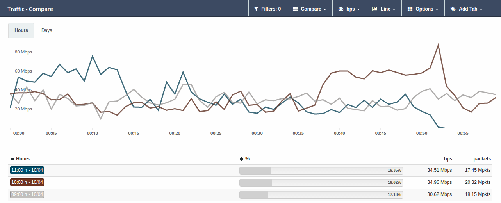

==== 5.3.4 Unique
A través de la vista *Unique*, el usuario podrá obtener información acerca de los elementos diferentes que han interactuado, al menos, una vez con la red en un periodo de tiempo determinado.

También, es posible seleccionar el grupo de atributos que se desea analizar mediante la opción *Group by*.

image::images/data-visualization/unique_view.png[align="center"]

=== 5.4 Tipos de agregación
El tipo de agregación permite que el usuario seleccione la unidad de medida en la que desea que se muestre la información.

Estas son las diferentes unidades y métricas que encontrará en esta pestaña:

* bps
* bytes
* packets
* packets/s
* flows
* flows/s

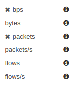

NOTE: Optimice sus métricas combinando diferentes tipos de agregación con las opciones de granuralidad (nivel de detalle temporal) que se encuentran disponibles.

=== 5.5 Granularidad
Llamamos granularidad al grado de detalle con el que podemos visualizar los eventos. Las opciones de granuralidad varían según el rango de tiempo que se esté mostrando (1h., 2h., last week, last month, all, etc.).

image::images/data-visualization/granularity.png[align="center"]

image::images/data-visualization/raw_with_granularity.png[align="center"]

NOTE: La vista Raw es la más indicada para aplicar granuralidad para observar los datos en detalle.

=== 5.6 Tipos de gráficas

Es posible seleccionar el tipo de gráfica con el que se desean visualizar los datos obtenidos en las diferentes vistas. Las opciones son muy similares a las que se muestran en el proceso de creación de widgets personalizados del capítulo dedicado a los Dashboards.

Las gráficas que se encuentran disponibles en cada momento dependerán de la vista seleccionada. En todos los tipos de gráficas se realiza una representación de los valores seleccionados en función del tiempo, de la granularidad y agregación seleccionadas y de las distintas opciones disponibles en función de la vista. A continuación se describen los distintos tipos de gráficas disponibles.

*Stacked*: composición de áreas apiladas, donde cada área representa el perfil temporal de un valor seleccionado.

image::images/data-visualization/stacked_graphic.png[align="center"]

*Area*: composición de áreas superpuestas, donde cada área representa el perfil temporal de un valor seleccionado.

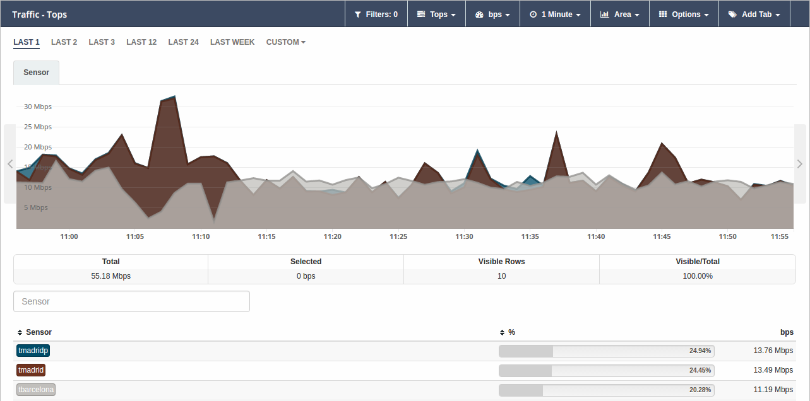

*Line*: composición de líneas superpuestas, donde cada línea representa el perfil temporal de un valor seleccionado.

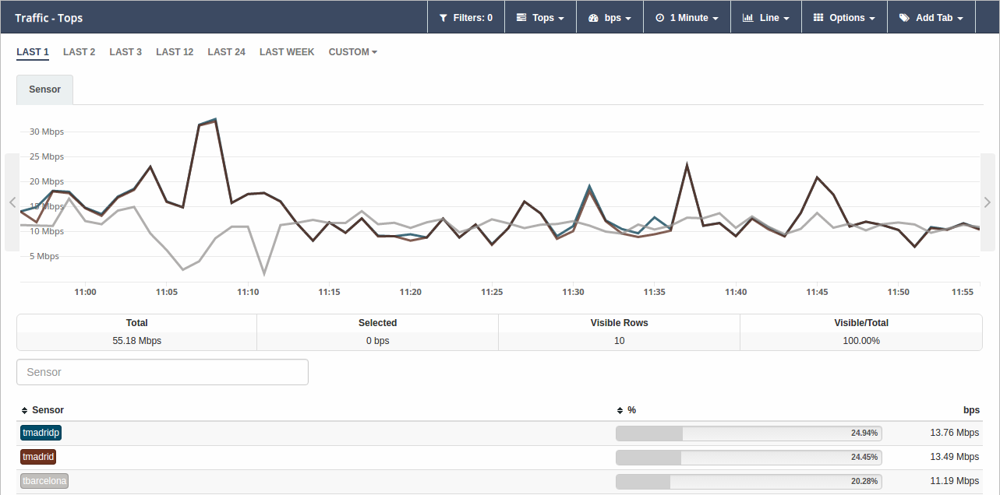

*Bars*: composición de conjuntos de barras superpuestas, donde cada conjunto de barras de distinto color representa el perfil temporal de un valor seleccionado.

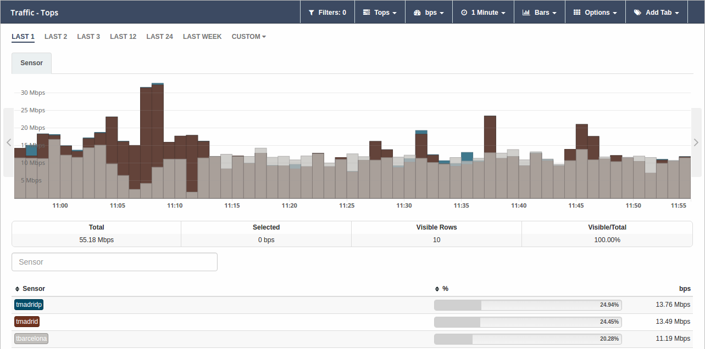

*SBars* (Stacked Bars): composición de conjuntos de barras apiladas, donde cada conjunto de barras de distinto color representa el perfil temporal de un valor seleccionado.

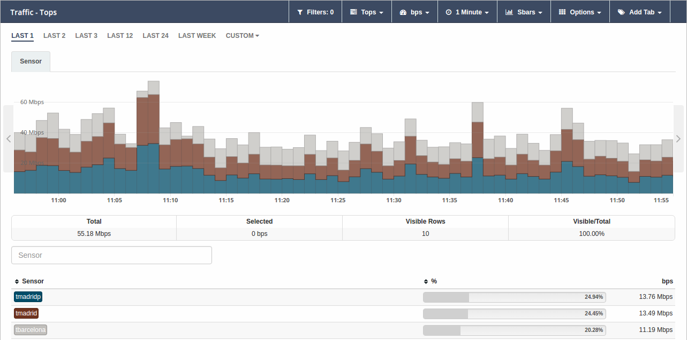

*Streams*: composición de flujos, donde cada flujo representa las relaciones entre distinos atributos. Esta gráfica solo está disponible para la vista Raw. En la imagen inferior se muestran los flujos de tráfico de un sensor entre IPs LAN y WAN.

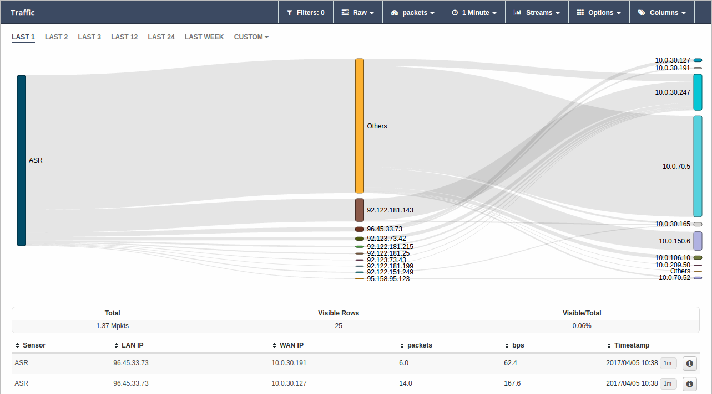

=== 5.7 Opciones
Cada una de las vistas presenta una serie de opciones que le permiten al usuario, entre otras acciones, visualizar el total del tráfico, exportar los datos a CSV o llevar al manager a un estado anterior para poder analizar comportamientos pasados.

A continuación se enumeran todas las opciones disponibles en esta pestaña. El usuario debe tener en cuenta que estas opciones variarán según la vista seleccionada previamente.

* Mostrar total (*Show Total*): al seleccionar esta opción se muestra en la gráfica una línea gris discontinua que representa la suma de las agregaciones de todos los atributos. Cuando esta opción se encuentra activa, en el listado de opciones se cambia esta opción por *Hide Total*. Disponible en las vistas Tops y Unique.

* Mostrar total de los filtrados (*Show Total Filtered*): al seleccionar esta opción se muestra en la gráfica una línea gris discontinua (más clara que la de la opción anterior) que representa la suma de las agregaciones de todos los atributos resultantes de aplicar los filtros seleccionados. Cuando esta opción se encuentra activa, en el listado de opciones se cambia esta opción por *Hide Total Filtered*. Disponible en la vista Tops.

* Exportar a CSV (*Export to CSV*): el usuario obtendrá un fichero de descarga en formato CSV que incluye los datos correspondientes al atributo que se seleccione, pudiendo fijar un límite de las filas que se incluirán en el archivo. Disponible solo para las vistas Tops, Raw y Unique.

image::images/data-visualization/export_to_csv.png[align="center"]

* Máquina del tiempo (*Time machine*): envía al manager a un estado anterior. Al seleccionar esta opción el usuario podrá visualizar los datos tal y como si estuviera viéndolos en el día y hora del momento pasado que haya indicado. Disponible para todas las vistas.

image::images/data-visualization/timemachine.png[align="center"]

* Guardar pestañas como predeterminadas (*Save tabs as default*): al aplicar esta opción, las columnas o pestañas de datos que se hayan incluido para el análisis se mostrarán por defecto en las nuevas consultas que se realicen. Disponible para las vistas Raw, Unique y Tops.

* Orden de las agregaciones (*Sort Aggregations*): mediante esta opción el usuario puede elegir el orden en el que se mostrarán las agregaciones disponibles. Disponible para las vistas Raw, Tops y Unique.

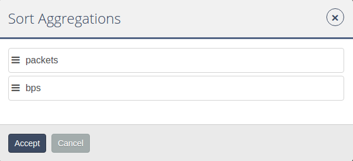

* Orden de las columnas (*Sort Columns*): mediante esta opción el usuario puede elergir el orden en el que se mostrarán las columnas disponibles. Disponible únicamente para la vista Raw.

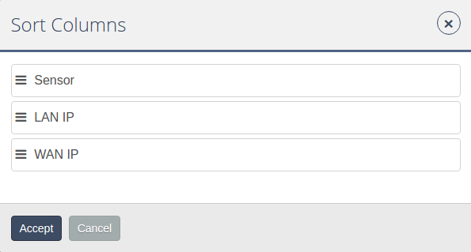

* Recargar (*Start Reloading*): activa la cuenta atrás para que se efectúe la recarga de los datos. En cualquier momento, el usuario puede detener esta recarga seleccionando *Stop Reloading* (opción que sustituye a Start Reloading una vez que ésta se ha activado). En el extremo izquierdo de la barra de sección aparecerá una cuenta atrás indicándole el tiempo de espera hasta la recarga. Disponible para la vista Raw.

image::images/data-visualization/traffic_submenu_with_reloading.png[align="center"]

=== 5.8 Atributos: pestañas y columnas
Los atributos nos ayudan a realizar un análisis exhaustivo y personalizado de cada uno de los elementos que intervienen en el tráfico de la red que se está analizando.

Estos se organizan en *pestañas o columnas* según la vista que estemos consultando. Las opciones que se muestran son comunes a todas las vistas salvo para el caso de Compare (ofrece solo la posibilidad de comparación no por atributos sino por semanas o meses).

A continuación enumeramos los atributos que el usuario tiene disponibles y los diferentes aspectos
que puede consultar de cada uno de ellos:

* Application
** Application
** Engine
** HTTP User Agent
** Host
** Host L2
** Referer
** Referer L2
** Selector
** Product Type
** URL
* Flow
** Direction
* Interface
** LAN Interface
** LAN Description
** WAN Interface
** WAN Description
* Location
** WAN IP Country
** WAN IP AS
** WAN IP MAP
** Service Provider
** Namespace
** Deployment
** Market
** Organization
** Campus
** Building
* Network
** Conversation
** LAN IP
** LAN IP Name
** LAN Net Address
** WAN IP
** WAN IP Name
** Protocol
** TOS
** Sensor Type
** Scatterplot
* Transport
** LAN L4 Port
** WAN L4 Port
** TPC flags
* UUID
** Service Provider UUID
** Namespace UUID
** Deployment UUID
** Market UUID
** Organization UUID
** Campus UUID
** Building UUID
