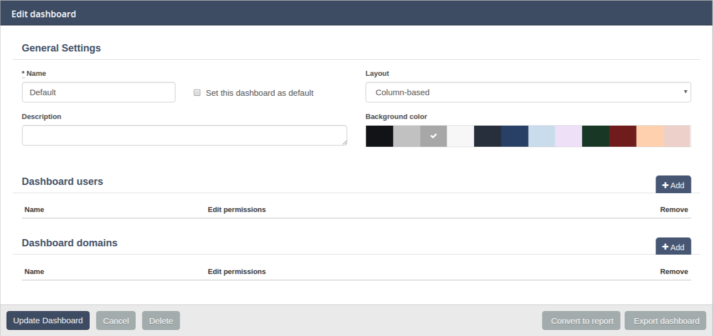
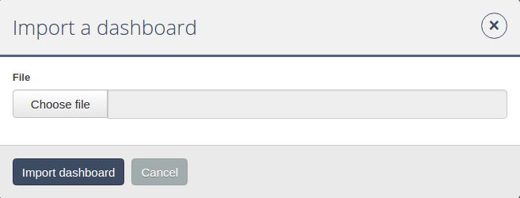

== Capítulo 6: Dashboards

=== 6.1 Opciones del Dashboard

La primera opción que encontramos en la barra de menú en el área de análisis es la de Dashboard. Esta es la opción que se encuentra seleccionada por defecto nada más ingresar al administrador del Manager redBorder:

image::images/dashboard/dashboard.png[align="center"]

La sección dashboard presenta múltiples opciones:

* Listado de dashboards disponibles: en la primera parte del menú de dashboards, el usuario visualizará los dashboards que se han creado y que están disponibles para su perfil.
*
Al lado de cada uno de los dashboards se encuentran dos iconos:

** image:images/dashboard/wrench.png[width=24, height=24] : permite visualizar y editar la configuración general del panel.
** image:images/dashboard/copy.png[width=24, height=24] : permite clonar el dashboard seleccionado.

* Añadir e importar dashboards (*Add dashboard/Import dashboard*): estas dos opciones permiten añadir un nuevo dashboard personalizado e importar aquellos que ya estén creados con el fin de poder compartirlos con otros usuarios o que se encuentren disponibles para otros perfiles.

* Añadir widget (*Add widget*): esta opción permite añadir los widgets que se deseen para personalizar el dashboards.

* URL de dashboard (*Dashboard URL*): esta opción copia el enlace del actual dashboard al portapapeles del sistema.

* Bloqueo (*Locked/Unlocked*): el usuario tiene la opción de bloquear/desbloquear el dashboard que esté consultando para que ningún otro usuario con permisos pueda editarlo.

* Máquina del tiempo (*Time Machine*): esta opción permite "viajar en el tiempo" y visualizar os resultados de las métricas de un día y hora determinados por el usuario a modo de histórico.

image::images/dashboard/dashboard_menu.png[align="center", frame=all]

==== 6.1.1 Editar y clonar dashboards disponibles
===== *Editar dashboard: Configuración general (General Settings)*
El usuario podrá modificar en cualquier momento la información asociada a cada uno de los dashboards disponibles seleccionando la opción Configuración general haciendo clic en el icono image:images/dashboard/wrench.png[width=14, height=14].

Información editable de la configuración general del dashboard:

* Nombre del dashboard (*Name*)
* Establecer el dashboard como predeterminado (*Set this dashboard as default*)
* Estructura de visualización de los widgets y métricas del dashboard (*Layout*)
* Descripción del contenido del dashboard (Description)
* Color de fondo (*Background Color*)
* Usuarios que pueden visualizar el dashboard y permisos de edición (*Dashboard users*): añadir y eliminar
* Dominios que se incluyen en el dashboard (*Dashboard domains*): añadir y eliminar

Además, en el margen inferior de la pantalla el usuario verá una serie de opciones disponibles:

* Actualizar dashboard (*Update dashboard*)
* Cancelar (*Cancel*)
* Borrar (*Delete*)
* Convertir a informe (*Convert to report*)
* Exportar dashboard (*Export dashboard*): el sistema creará un archivo comprimido para su descarga; paso necesario en caso de que se quiera realizar una importación.

clonar dashboard (*Clone dashboard*): es posible clonar (copiar) los dashboards con el fin de enerlo disponibles para diferentes usuarios, importarlo, etc. Para ello, basta con asignarle un nombre al dashboard copiado.

image::images/dashboard/clone_dashboard.png[align="center"]

==== 6.1.2 Añadir dashboard
Los dashboards permiten tener un resumen visual que incluye los principales KPIs que son necesarios para el análisis de una infraestructura de red. El usuario puede combinar una serie de widgets que le permitan, una sola mirada, obtener información muy valiosa sobre las tendencias, cambios y excepciones asociadas al tráfico que se produce o pasa por su red.

Para crear un nuevo dashboard es necesario seleccionar la opción *Add dashboard*. A continuación, introducir una serie de datos de configuración general y guardar los cambios mediante el botón *Create dashboard*. El primer paso para crear un dashboard personalizado es la creación de un panel en blanco al que, posteriormente, se le añadirán aquellos widgets que cumplan con nuestras necesidades de
visualización.

Para crear un nuevo dashboard debemos indicar una serie de preferencias en la interfaz de Configuración general (*General Settings*), anteriormente descrita para la edición de dashboards.

image::images/dashboard/add_dashboard.png[align="center"]

==== 6.1.3 Importar dashboard
La opción *Importar dashboard* es muy útil en el caso de que queramos compartir dashboards con otros usuarios , o incorporar a redBorder información obtenida de otras aplicaciones compatibles.

IMPORTANT: Para importar un dashboard, es necesario que este, previamente, haya sido exportado como fichero comprimido y se encuentre disponible entre nuestros archivos.

Debe seleccionar el archivo que se desea importar y a continuación hacer clic sobre la opción *Import dashboard*. Una vez que hayamos realizado la importación, encontraremos este nuevo dashboard
dentro del listado de dashboards disponibles.

==== 6.1.4 Añadir widget: personalización de los dashboards
El usuario puede crear y añadir widgets a sus dashboards con el fin de personalizar al máximo la visualización de los datos obtenidos por las diferentes Apps. Es posible incorporar tanto widgets preconfigurados como crear widgets 100% personalizados.

El primer paso consiste en seleccionar el tipo de widget que se quiere añadir. Existen tres tipos de widgets dependiendo del tipo de información que queramos visualizar:

* *Apps*: visualización de los datos recibios por las diferentes Apps.
** Traffic
** Intrusion
** Mobility
** Social
* *Estado*: visualización de la configuración y estado de las máquinas e infraestructura de la red.
** Infraestructure
* *Formato*: permite configurar el contenido y el formato de los widgets: texto, imágenes, URL, etc.
** Shapes

image::images/dashboard/widget_selection.png[align="center"]

===== 6.1.4.1 Personalizar un widget de producto
Algunos de los widgets que el usuario encuentra disponibles para añadir al dashboard de la plataforma redBorder permiten una personalización completa.

Este es el caso del widget asignado a la App *Intrusion*. En primer lugar, veamos qué opciones de personalización se incluyen en este tipo de widgets.

El primer paso consiste en seleccionar el modo de visualización de datos o la cardinalidad, esto es, de qué modo deseamos visualizar los valores o datos de una determinada columna.

[NOTE]
==================================
Los eventos recibidos por el Manager están compuestos por duplas del tipo "columna:valor". Los valores que se indican en cada columna pueden entenerse como datos propios del evento que son los que realmente nos aportan información.

A lo largo de este documento podrán encontrarse referencias al concepto de columna como "atributo" o "dimensión".

El primer paso para personalizar un widget consiste en seleccionar el modo de visualización de los datos, pudiendo elegir además, vistas en las que se representa la cardinalidad de los mismos.
==================================

====== *Configuración de widgets según vistas de eventos:*
* *Bandwith Line*: es un widget predefinido que muestra el uso del ancho de banda en bps. Muestra una gráfica simple. Es característico de la app *Traffic*.
* *Bandwith*: es como *Bandwith line* ofreciendo un contenido más detallado. Es característico de la app *Traffic*.
* *Map*: muestra información de geoposicionamiento. Es característico de la app *Traffic*
* *Movements*: muestra información de movimiento asociada a los eventos. Es característico de la app *Mobility*
* *RAW*: muestra los eventos en bruto (sin agregación).
* *Tops*: agrega los eventos n base a una unidad para mostrar los más destacados, de manera que lo que se muestra es la suma del total de datos de diferentes eventos para mostrarlos como uno único.
* *compare*: comparativa en el tiempo (horas, días, semanas y meses) de los eventos más destacados.
+
Un ejemplo de uso sería el de comparar en distintos días la evolución temporal del tráfico para una aplicación en concreto. A diferencia de la vista Tops, esto solo permite el estilo de gráfico "Serie".
* *Performance Index*: permite definir un indicador donde visualizar el rendimiento de los eventos que se deseen.

====== *Configuración de widgets según cardinalidad:*
* *Single Unique*: mediante esta opción se aislan las ocurrencias o eventos de una columna para un momento determinado.
* *Group Unique*: mediante esta opción se aislan las ocurrencias o eventos de una columna para un momento determinado agrupados según determinados criterios.

===== 6.1.4.2 Personalizar un widget de estado
El usuario puede elegir entre cuatro tipos de widgets aplicables a las opciones de configuración del Manager redBorder. La opción de *Infrastructure* permite seleccionar el modo en el que se va a visualizar la información sobre configuración y estado de la infraestructura de red:

* *Sensor*: Mapa/Árbol
* *Clúster*: Diagrama/Tabla
* *Alarm*: insertar detalles de configuración en el formulario adjunto
* *Monitor*: Serie/Valor

===== 6.1.4.3 Widgets de formato

La opción *Shapes* nos permite editar e insertar elementos auxiliares en nuestros widgets tales como: texto, imagen, forma del widget e incrustar una URL personalizada.

Para incorporar cualquiera de estos elementos a los widgets, basta con completar el formulario que aparezca en cada caso y aplicar los cambios mediante la opción *Create Widget*.
