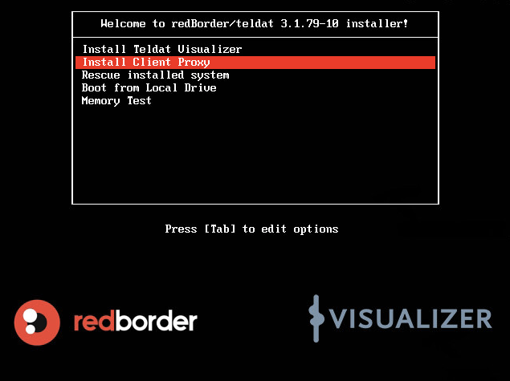
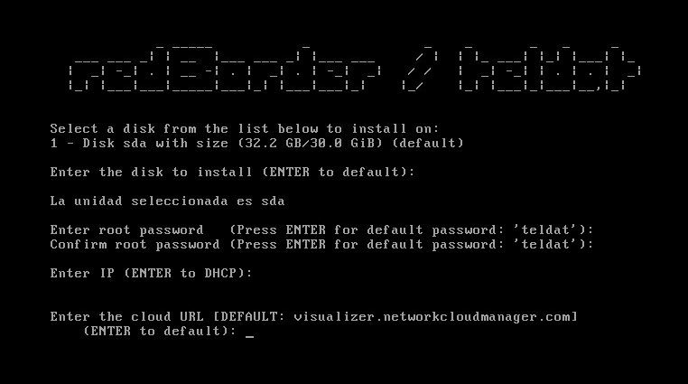
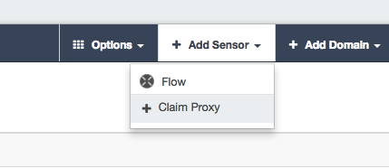
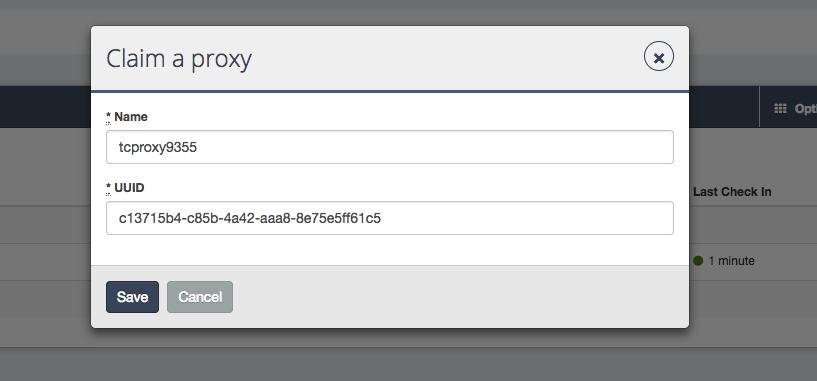
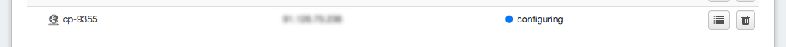
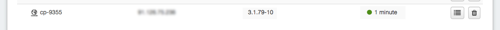

== Capítulo 8: Client Proxy

=== 8.1 Introducción

El client proxy (proxy cliente) es un tipo especial de sensor. Más que un sensor, en realidad se trata de un sistema que representa al cluster allá donde se instale y al que se le pueden asociar sensores directamente. Su principal utilidad es poder instalarlo y asociarle sensores en redes e instalaciones que, por política de seguridad, no pueden acceder directamente al cluster de managers (o al servicio en la nube).

=== 8.2 Instalación

Para la instalación, se procederá de un modo muy similar al manager. Usando la misma imagen ISO, cuando arranuqe y muestre el menú de instalación, seleccionaremos "Install Client Proxy".

Tras esto, nos saldrá una lista de preguntas con respuestas por defecto, igual que el proceso de instalación del manager, salvo que al final nos preguntará por la URL del cluster al que conectar, con la URL de la cloud valor por defecto (visualizer.networkcloudmanager.com)

Comienza por fin el proceso de instalación.

Una vez finalizado, el sistema se reiniciará y nos aparecerá la terminal con el siguiente contenido:

image::images/client-proxy/install-03.png[align="center"]

En él, aparece información relativa al UUID asignado al client proxy, su dirección IP, la MAC e información sobre los servicios del cluster a los que representa:

=== 8.3 Registro

Tras la instalación del client proxy, se requiere un paso más que consistirá en el registro del equipo en el cluster (ya sea on-premise o cluster en la nube). Para que este paso se cumpla con éxito, el client proxy deberá tener acceso https/443 al cluster (on-premise o en la nube) sin restricciones.

El primer paso para el proceso de registro consiste en que el client proxy se identifica en el cluster como un sensor sin reclamar. Como el UUID del client proxy es conocido en el proceso de instalación, deberemos usar dicho UUID para localizar el equipo en la lista de sensores sin reclamar. Para ello, entramos en la web de redborder y vamos a Sensors -> add sensor -> Claim proxy.

A continuación le ponemos un nombre y el UUID que mostró en la instalación.

Si el client proxy con ese UUID realmente está entre los no reclamados, el sistema lo localizará y lo asignará al namespace al que pertenece el usuario como un sensor más.

En principio, mientras se esté configurando así se indicará en su estado.

Si todo ha ido bien, una vez terminada la configuración y el proceso de registro y reclamación, aparecerá su nuevo estado:

